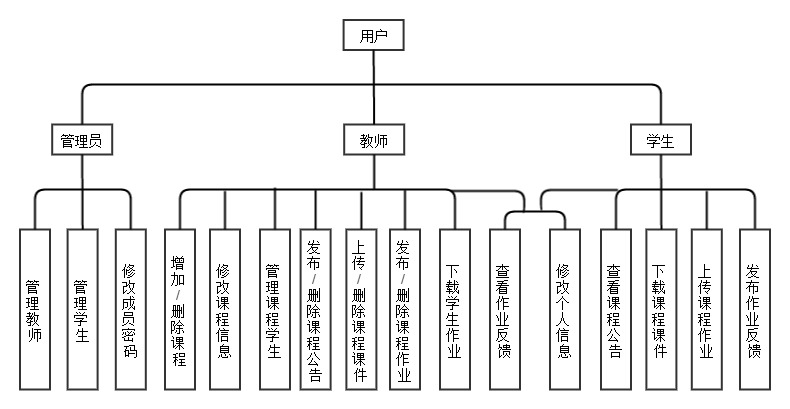
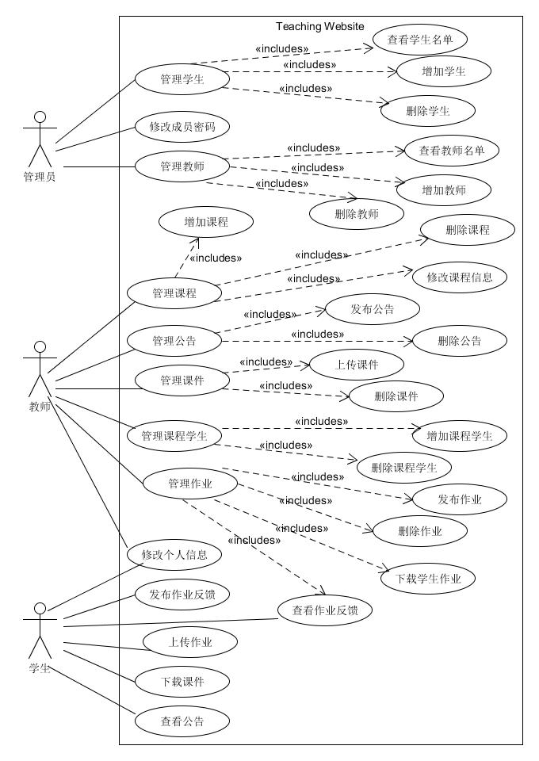
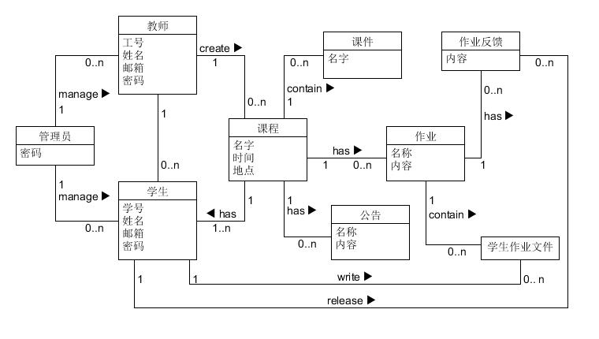
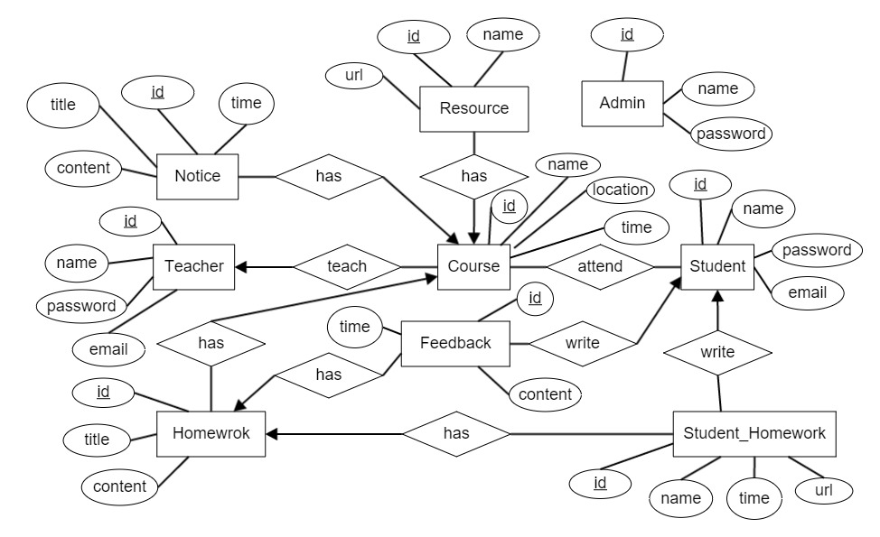
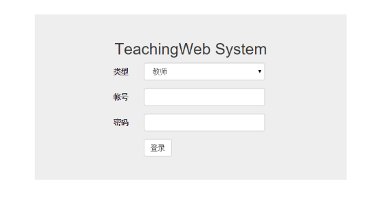
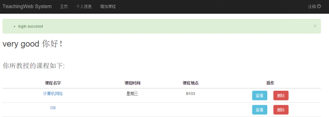
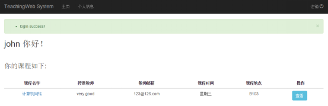
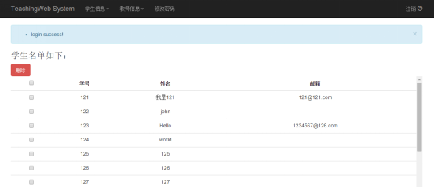
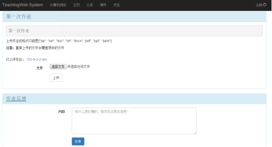
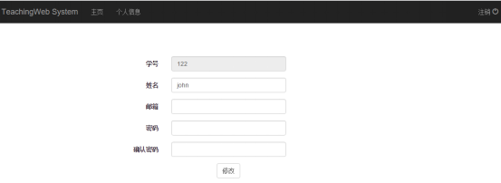

# TeachingWeb

This is a teaching management which teacher can publish the notes、courseware and homework while students can download the resource which teachers publish in the website and upload the homework files. It supports teachers manage their different courses. There are three different roles in the system: system manager、teacher and student. Their authority are shown as below



## Framework

* Flask
* Bootstrap
* SQLAlchemy

## How to Run

First, you should make sure you have configured the `python` environment. Then you should execute the commands which are shown below one by one.

```python
pip install flask
pip install flask-login
pip install flask-sqlalchemy
pip install sqlalchemy-migrate
pip install flask-whooshalchemy
pip install flask-wtf
pip install flask-babel
pip install flup
pip install flask-bootstrap
pip install werkzeug
pip install wtforms
pip install functools
pip install xlrd
```

After that, open the project folder and execute the follow commands

```python
python createDB.py
python TeachingWeb.py
```

Finally, open the browser and enter `http://127.0.0.1:5000/` and then enjoy it.

## Pictures

### use case diagram



### domain diagram



### Entity Relationship Diagram



### Screenshot











